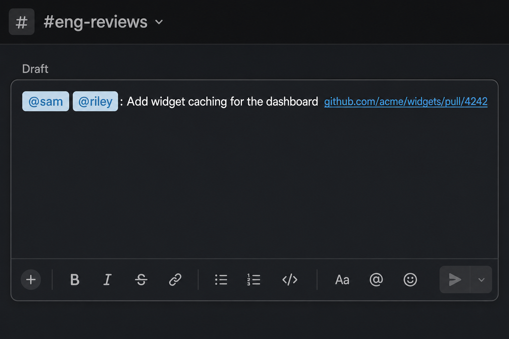

# r4r

**This repository is fully AI-generated.**

Ready-for-review helper: from the GitHub or Graphite tab you already have open, add the `ready for review` label and either draft a Slack ping or copy title + link.

## Why

Asking for review is a pile of small steps: add a label, remember who you actually requested (not CODEOWNERS auto-adds), look up Slack handles, paste the title and URL, then dismiss the giant GitHub/Graphite unfurl. r4r does that from a hotkey.

⌘⌥R writes a Slack **draft** with real mention pills (not raw `<@U…>` text) so you can edit before send. ⌘⌥⇧R copies the same line with no mentions when you want to paste it yourself. Links are protocol-less (`github.com/…` instead of `https://…`) so Slack autolinks them without a preview.

## Example

Sample data only (`acme/widgets`, `@sam`, `@riley`).

**Slack draft (⌘⌥R)** — mentions, title, protocol-less link, no unfurl:



**Clipboard (⌘⌥⇧R / `r4r --copy`)** — same line, no mentions:

```
Add widget caching for the dashboard github.com/acme/widgets/pull/4242
```

## What it does

- **`r4r <pr>`** — labels the PR and creates a Slack draft pinging manually requested reviewers (skips CODEOWNERS auto-requests).
- **`r4r --copy <pr>`** — labels the PR and copies `{title} {url-without-https}` to the clipboard. No mentions, no Slack draft.
- **Raycast ⌘⌥R** — grab the front browser tab URL and run the Slack-draft flow.
- **Raycast ⌘⌥⇧R** — same, but copy title + link (no mentions, no Slack draft).

Auth tokens, Slack cookies, and the GitHub→Slack user map are **not** in this repo. They stay on your machine.

## Setup

### PATH

```bash
export PATH="$HOME/dev/r4r:$PATH"
```

Use your clone path if it isn't `~/dev/r4r`.

### Dependencies

- [`gh`](https://cli.github.com/) (GitHub CLI), logged in
- `jq`, `curl`
- [`slackcli`](https://github.com/shaharia-lab/slackcli) for Slack drafts (not needed for `--copy`):

  ```bash
  brew tap shaharia-lab/tap && brew install slackcli
  slackcli auth parse-curl --login
  ```

  That writes `~/.config/slackcli/workspaces.json`. Do not commit it.

### GitHub → Slack map

Drafts resolve GitHub logins to Slack user IDs via `infrastructure/github-to-slack.json` in a local [clay-base](https://github.com/clay-run/clay-base) checkout (`~/dev/clay-base` by default). Override with `R4R_CLAY_BASE`.

### Raycast

Add this repo's `raycast/` folder as a Script Commands directory.

Grant Automation access when macOS prompts (System Events + your browser) so the front-tab URL can be read.

## Usage

```bash
r4r                         # live listen (paste a PR URL/number)
r4r 1234                    # one-shot against the default repo
r4r https://github.com/org/repo/pull/1234
r4r --copy <pr>             # clipboard only (no Slack draft)
r4r --dry-run <pr>          # preview; no label, no draft
r4r --channel C0123456789 <pr>
```

## Config

| Variable | Default | Purpose |
| --- | --- | --- |
| `R4R_SLACK_CHANNEL` | `C0A1HCU4PRB` | Slack channel id for drafts |
| `R4R_REPO` | `clay-run/clay-base` | GitHub repo when you pass a bare PR number |
| `R4R_CLAY_BASE` | `~/dev/clay-base` | Checkout that contains `github-to-slack.json` |
| `R4R_SLACKCLI_CONFIG` | `~/.config/slackcli/workspaces.json` | slackcli browser session |
| `R4R_LOG` | `~/Library/Logs/r4r.log` | Log file |
| `R4R_OPEN_SLACK` | `1` | Set `0` to skip opening Slack after drafting |
| `R4R_BIN` | this repo's `r4r` | Override the binary `r4r-from-browser` runs |

## What's not in this repo (on purpose)

- Slack `xoxc` / `xoxd` tokens and cookies
- `~/.config/slackcli/workspaces.json`
- `github-to-slack.json`
- Logs
